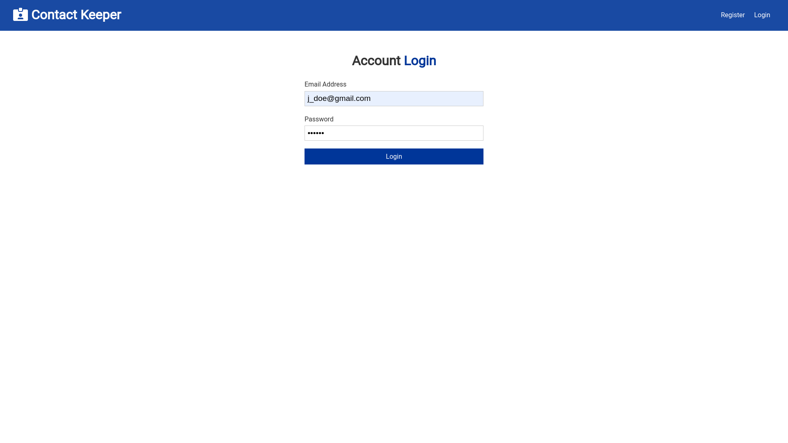
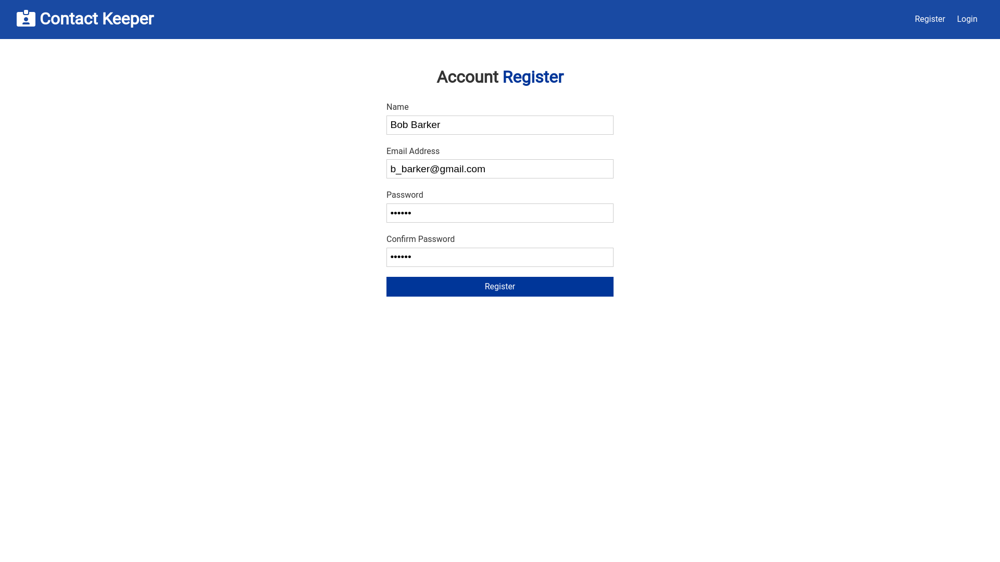
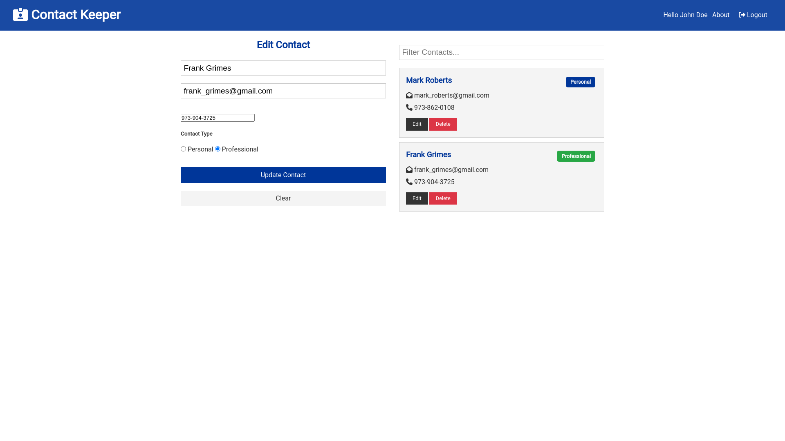
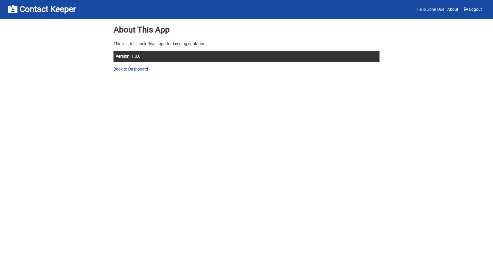

# Contact Keeper React Project

This is a small React CRUD application that can be connected to a MongoDB back-end.
Users can create an account and keep track of their contacts information.

## Install Dependencies

Make sure to run ```npm i``` within both the ***root*** folder and also the ***client*** folder.

## Login



## Register



## Dashboard


## Update Contact



## About



## Mongo DB Cluster

In order to take advantage of the functionality of this project, you must create a Mongo DB cluster by registering an account at : [Register an account for MongoDB](https://www.mongodb.com/cloud/atlas/register)

# Config default.json

* For development server

```
{
    "mongoURI": "mongodb+srv://<mongoDB_UserName>:<password>@contactkeeper.lbd94.mongodb.net/myFirstDatabase?retryWrites=true&w=majority"
}
```

* For production server

# Config production.json

```
{
    "mongoURI": "mongodb+srv://<mongoDB_UserName>:<password>@contactkeeper.lbd94.mongodb.net/myFirstDatabase?retryWrites=true&w=majority"
}
```

# Try Catch in db.js

useCreateIndex and useFindAndModify are no longer supported. need to remove them in
order to connect to DB

```javascript
const connectDB = async () => {
    try {
        await mongoose.connect(db, {
            useNewUrlParser: true,
            // useCreateIndex: true,
            // useFindAndModify: false
        })

        console.log('MongoDB Connected')
    } catch (err) {
        console.error(err.message)
        process.exit(1)
    }
}
```